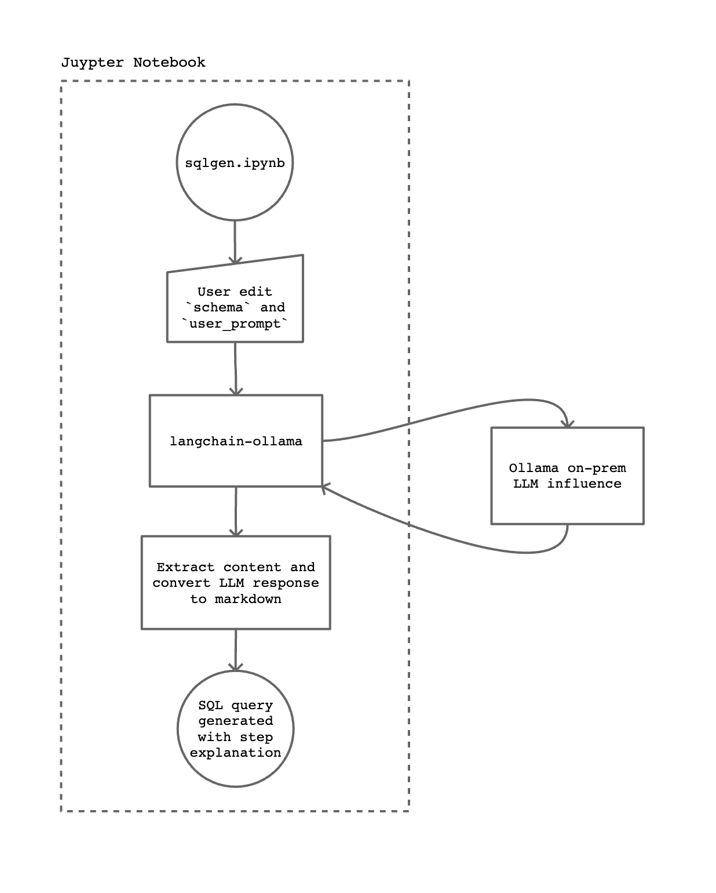
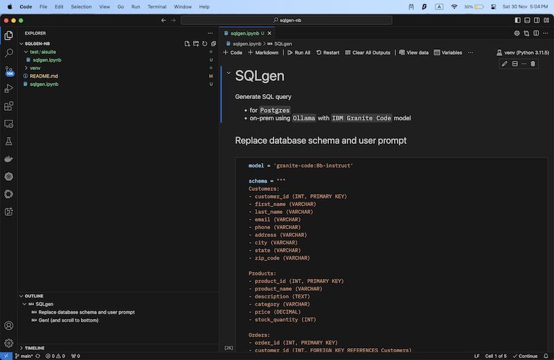
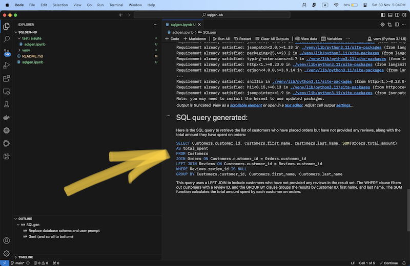

# sqlgen-nb

Write PostgreSQL query from natural language using on-prem gen AI -- with IBM Granite Code LLM, Ollama and having Juypter Notebook as frontend. 

Inspired by a use case mentioned by Anthropic, this is a minimal and local implementation of that idea. 



## Installation 

Jupyter Notebook https://marketplace.visualstudio.com/items?itemName=ms-toolsai.jupyter 

LangChain https://python.langchain.com/docs/how_to/installation/

Ollama https://ollama.com/download 

Pull `IBM Granite Code` model in Terminal: 

```zsh
ollama pull granite-code:8b-instruct 
```

## Usage 

1. Open `sqlgen.ipynb` 
2. Enter your database schema in `schema =` 
3. Enter your question in `user_prompt =` 
4. Click `Run all` to run all the cells in the Juypter Notebook 
5. Scroll to the bottom for the SQL query generated 





## Challenges & limitations 

Gen AI is non-deterministic. With the same user prompt, it generates slightly different completions every time. Verify before use. 

